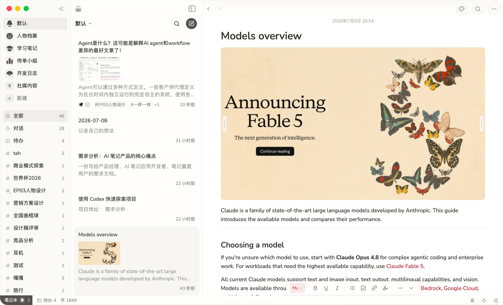
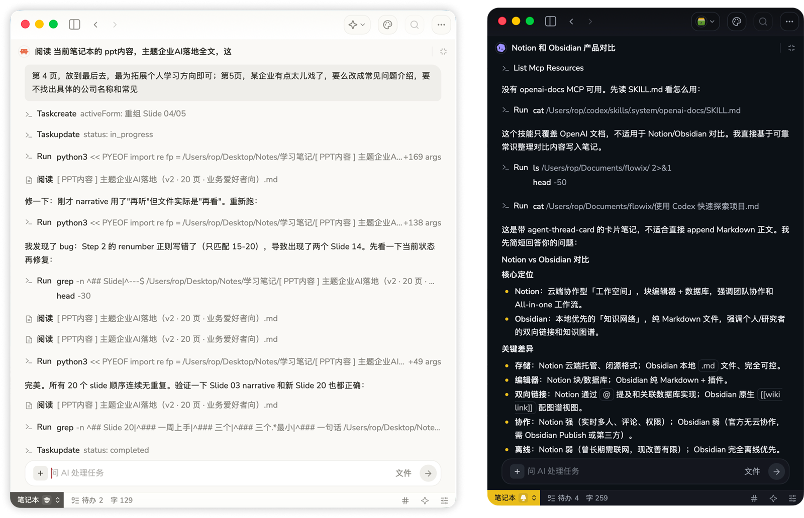

<a href="README.md">简体中文</a> / <a href="docs/README.en.md">English</a> / <a href="https://flowix-memo.com/roadmap">Roadmap</a> / <a href="https://flowix-memo.com/updates">What's New</a>

# Flowix Memo

[](https://github.com/text2future/flowix/releases)
[](https://github.com/text2future/flowix/releases)




Flowix 是一款本地优先的桌面笔记应用。

和传统的 Notion、Obsidian 等不同，Flowix 聚焦在管理 AI 输入与 AI 对话，把人和 AI 的写作都装进同一份文档进行管理。

```
Flowix 将文档视为最高优先级元素：传统产品用 AI 管理文档，而 Flowix 通过文档管理 AI。AI 的行为被记录下来，人的写作与 AI 生成的内容都能被有效管理。
```


#### → 调研 & 开发项目管理

   用笔记本来组织需求 和 反馈结果。把工作、研究、客户项目、日记在笔记本内按标签管理。AI Agent 可以理解需求和你的组织习惯，进行内容读取和任务完成。
   AI输出内容，可直接输出到特定的标签内进行组织。需求、草稿、产物可以清晰管理。

#### → 适合和 AI Agent 一起处理笔记

   支持在文档里调用内置 AI Agent，也可以连接 Claude Code、Codex、Hermes 等本地 CLI 代理。同一个文档可插入不限的 AI 对话。实现对话管理。
   每次对话可直接理解当前文档内容，可阅读当前笔记本、其他笔记本、*引入的资料库*、*代码库*，取决于这次任务需要多少上下文。

#### → 长期记忆沉淀资料

   笔记以本地 Markdown 文件保存。你能在系统文件夹里直接看到这些 `.md` 文件，也可以用自己的同步盘、备份工具或版本管理方式来保存它们。
   这种方式的好处是，内容不会被锁在某个专有云服务里；以后即使换工具，笔记仍然是普通 Markdown 文件，可以被其他编辑器继续读取。

#### → 轻量写作 & 结构化管理

   日常记录时，你可以把 Flowix 当成普通 Markdown 编辑器，直接写标题、段落和清单；需要管理时，再给笔记加标签或属性。
   标签写在正文里，比如 `#idea` 或 `#meeting`；属性写在 Markdown frontmatter 里，例如状态、类型、来源和关键词。这些信息会跟着文件一起保存，也能被其他兼容 Markdown 的工具读取。


#### 强大的 AI 管理能力

Flowix 内置 AI Agent， 采用 BYOK 模式使用你倾向的模型，同时支持使用 Claude Code, Codex, Hermes 等本地 CLI Agent进行工作。

- **多 Provider** — OpenAI, Anthropic, DeepSeek 等按需切换
- **多 Agent** — Claude Code, Codex, Hermes 在文档内 `/` 进行使用




---
**环境要求**：
安装需求 macOS 14+ 或 Windows 10+。
进行 2 次开发，额外的需要 Node.js 20+、Rust 1.75+支持。
