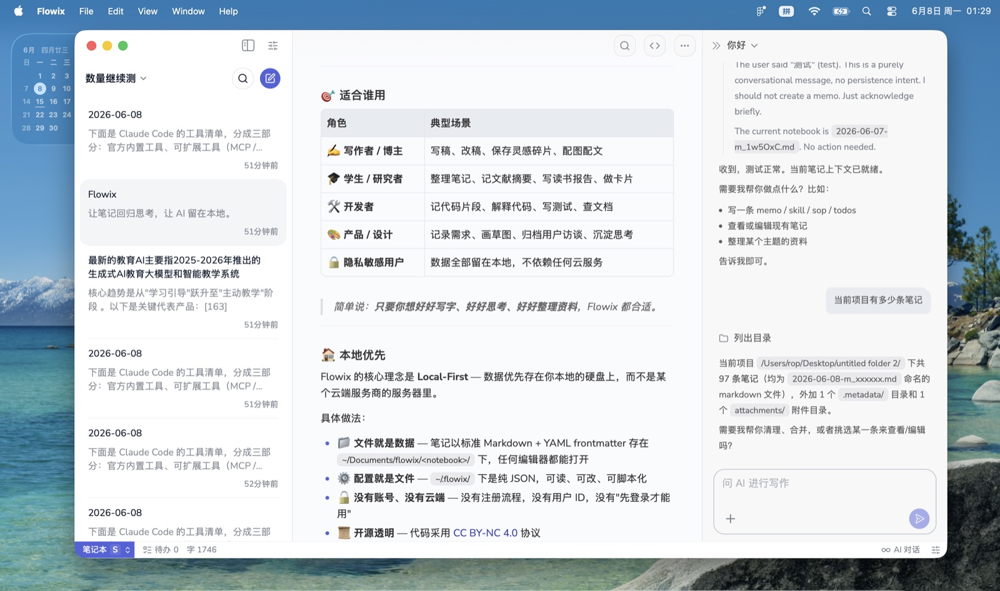
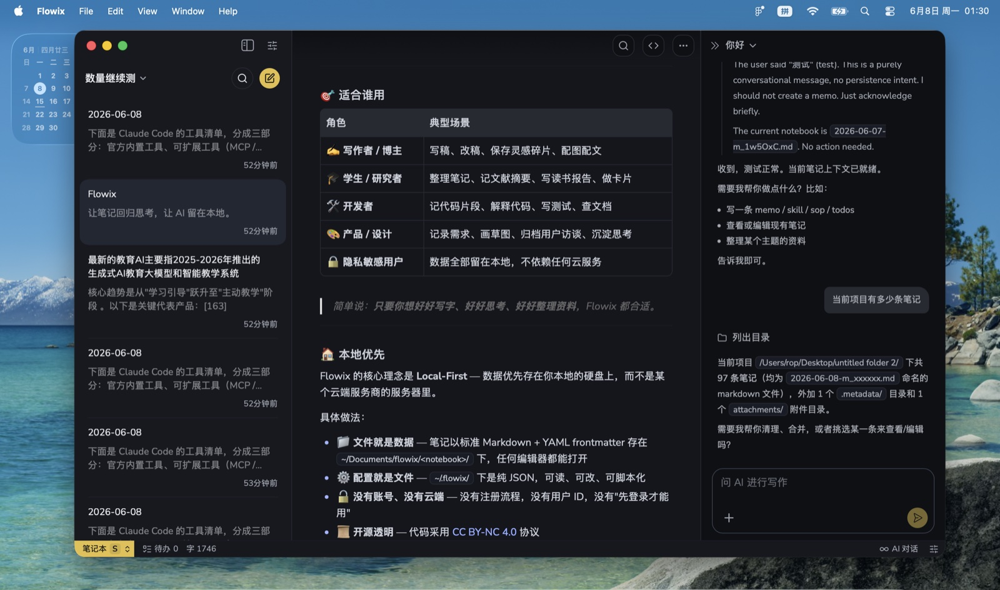
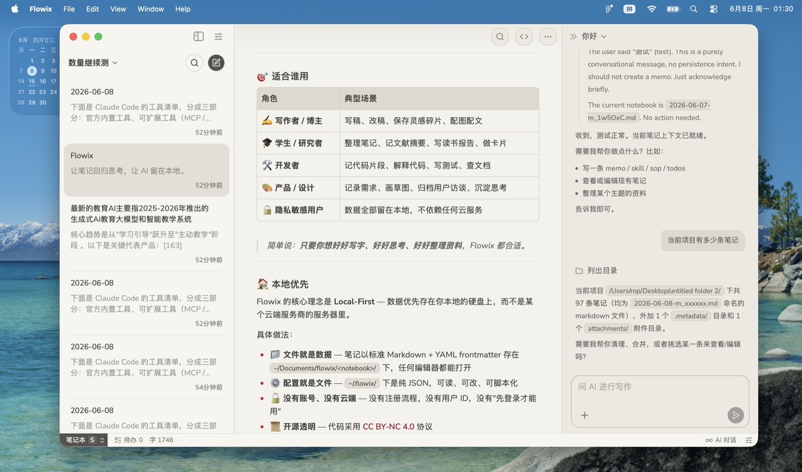

<div align="center">

# Flowix

**让笔记回归思考，让 AI 留在本地。**
*Notes that think with you. AI that stays with you.*

一款本地优先的桌面笔记应用 — 简洁、有条理，AI 真正嵌进你的写作流程。
*A local-first desktop note app — clean, organized, with AI woven into your writing flow.*

</div>

<div align="left">

🌐 **切换语言 / Switch language** — 点击下方任一标题即可在两种语言间切换，*互斥展开*。
*Click either heading below to toggle. Only one is open at a time.*

</div>

---

<div align="center">

### 🎨 主题预览 · Theme preview

**☀️ 浅色 · Light**


**🌙 深色 · Dark**


**🪨 岩灰 · Rock**


</div>

---

## 🇨🇳 中文

<details name="lang" open>
<summary>点击展开 / 收起 中文版本</summary>

> 💡 **Flowix 是什么？**
> 你的桌面笔记工作台。本地存储 Markdown 文件，AI 代理随时待命。
> 你的数据归你，你的 AI 听你。

### ✨ 简介

Flowix 是一款**本地优先**的桌面笔记应用。

你写下的每一个字都存在自己的硬盘上，结构开放、可以随时迁移；
AI 助手随时待命，帮你润色、总结、翻译、查资料、写代码 —
但**绝不在你不知情时把数据传走**。

我们相信好的工具应该**不抢内容、不打扰工作、不绑架数据**：
没有广告、没有算法推送、没有"先登录才能用"。

---

### 🎯 适合谁用

| 角色 | 典型场景 |
|------|---------|
| ✍️ **写作者 / 博主** | 写稿、改稿、保存灵感碎片、配图配文 |
| 🎓 **学生 / 研究者** | 整理笔记、记文献摘要、写读书报告、做卡片 |
| 🛠️ **开发者** | 记代码片段、解释代码、写测试、查文档 |
| 🎨 **产品 / 设计** | 记录需求、画草图、归档用户访谈、沉淀思考 |
| 🔒 **隐私敏感用户** | 数据全部留在本地，不依赖任何云服务 |

> 简单说：**只要你想好好写字、好好思考、好好整理资料**，Flowix 都合适。

---

### 🏠 本地优先

Flowix 的核心理念是 **Local-First** — 数据优先存在你本地的硬盘上，而不是某个云端服务商的服务器里。

具体做法：

- 📁 **文件就是数据** — 笔记以标准 Markdown + YAML frontmatter 存在 `~/Documents/flowix/<notebook>/` 下，任何编辑器都能打开
- ⚙️ **配置就是文件** — `~/.flowix/` 下是纯 JSON，可读、可改、可脚本化
- 🔓 **没有账号、没有云端** — 没有注册流程，没有用户 ID，没有"先登录才能用"
- 📜 **开源透明** — 代码采用 [CC BY-NC 4.0](LICENSE) 协议
- 🧳 **可携带** — 整个数据目录打个 zip 就能带走到任何机器
- 🕵️ **不留痕** — 没有遥测、没有崩溃上报、没有后台数据收集

> 一句话：**你的笔记永远属于你**，不管 Flowix 以后还在不在。

---

### ✏️ 编辑体验

- **所见即所得的 Markdown** — 标准语法，兼容所有第三方工具
- **Tiptap 内核** — 流畅的块级编辑、表格、任务列表、代码高亮
- **Mermaid 图表** — 直接画流程图、时序图、甘特图
- **文件附件** — 图片、PDF、Office 文档都能嵌进笔记
- **多笔记本** — 按项目 / 主题分开，互不干扰
- **标签 + 收藏** — 横向分类（tag）+ 纵向重要级（收藏）两套维度
- **全局搜索** — 跨笔记本全文搜索，毫秒级响应
- **键盘党友好** — 完整快捷键 + `Cmd+K` 命令面板

---

### 🤖 AI 能力

Flowix 内置 AI 代理，**不锁死单一服务商**，你自己选。

- 🧠 **多 Provider** — OpenAI / Anthropic / DeepSeek，按需切换
- ⚡ **流式响应** — AI 边想边写，你不用干等
- 🛠️ **工具调用** — AI 不只是聊天，它能直接读写笔记、搜索文件、调用工具
- 👀 **可观测** — 每次对话过程都看得到，方便你判断 AI 在干嘛
- 🛡️ **数据可控** — 只有你主动发消息时内容才离开本机，AI 不在后台偷数据
- 💾 **本地缓存** — AI 响应可缓存可复阅，关掉窗口也不丢

**典型 AI 场景**：

- 把一段口语化文字润色成书面语
- 给一篇长笔记生成摘要 / 提取待办
- 解释代码、写测试、生成正则
- 翻译、改写、扩写、缩写
- 帮你读完一篇 PDF 然后回答问题

---

### 🖥️ 桌面原生

- **Tauri 2 + Rust** — 安装包小、启动快、内存占用低
- **跨平台** — macOS（Intel / Apple Silicon）/ Windows 10+
- **多窗口** — 一条笔记可以单独开窗，方便对照阅读
- **文件关联** — 双击系统里的 `.md` 文件自动用 Flowix 打开

---

### 🚀 快速开始

```bash
# 克隆
git clone https://github.com/aicollaborate/flowix.git
cd flowix

# 安装依赖
npm install

# 开发模式（启动完整应用）
npm run tauri dev

# 仅前端开发（localhost:1420）
npm run dev

# 生产构建
npm run tauri build
```

**环境要求**：Node.js 20+、Rust 1.75+、macOS 14+ 或 Windows 10+。

---


### 🛠️ CLI 工具 (sidecar)

Flowix 自带一个独立的命令行工具 `flowix-cli`, 跟桌面端**共享同一份 `memo_file` 存储**。Terminal 跑的修改, 桌面端 watcher 会 1 秒内自动反映; 反之亦然。

构建并暴露给 PATH:

```bash
# 1. 编译 CLI (release, 当前 host)
npm run cli:build

# 2. 把 sidecar 软链到 PATH
ln -sf "$(pwd)/app/flowix-desktop/binaries/flowix-cli-$(rustc -vV | sed -n 's|host: ||p')" /usr/local/bin/flowix-cli

# 3. 验证
flowix-cli --version
```

或者从已经构建好的 `.app` 内部拷出:

```bash
cp "app/flowix-desktop/target/release/bundle/macos/Flowix.app/Contents/MacOS/flowix-cli" /usr/local/bin/
```

#### 命令一览

```bash
flowix-cli --version
flowix-cli --help

flowix-cli notebooks              # 列出所有笔记本
flowix-cli list <notebook>        # 列出某笔记本下的笔记
flowix-cli show <id>              # 读一条笔记到 stdout
flowix-cli create <notebook>      # 从 stdin 创建 (echo "# title" | flowix-cli create work)
flowix-cli write <id>             # 从 stdin 覆盖整条笔记
flowix-cli edit <id> --old <text> --new <text>
flowix-cli search <query>         # 全文搜索
```

#### 环境变量

- `FLOWIX_HOME` — 覆盖 config dir (默认 `~/.flowix`)
- `FLOWIX_DATA` — 覆盖 data dir (默认 `<OS data dir>/flowix`)

#### 数据流

- CLI 读 `~/.flowix/notebook.json` + `<notebook>/.metadata/index.json` + `<notebook>/*.md`
- 写路径走原子写 (write tmp + fs::rename), 跟桌面端共享同一份代码 ── 不会分裂
- 与桌面端**完全独立**的进程, 互不冲突; 桌面端 watcher 监测 `index.json` 变化自动 reload

---

### 📦 Distribution (CI / Homebrew)

Release artifacts 由 GitHub Actions 自动构建 (`.github/workflows/release.yml`):

- 3 平台 sidecar: macOS (arm64 + x64) / Linux / Windows
- 3 平台 Tauri bundle: `.dmg` / `.msi` / `.deb` + `.AppImage`
- 触发: `git tag v0.1.0 && git push --tags`

装 CLI (macOS, Homebrew):

```bash
brew install aicollaborate/flowix/flowix
# 或 .app:
brew install --cask aicollaborate/flowix/flowix
```

下载 `.dmg` / `.msi` / `.AppImage` 走 [GitHub Releases](https://github.com/aicollaborate/flowix/releases)。

---

### 🤝 参与贡献

欢迎 PR、Issue、Discussion。
提交代码前请读 [CLAUDE.md](CLAUDE.md) 了解项目结构与约定。

### 📄 License

[CC BY-NC 4.0](LICENSE) — 署名、非商业使用。商业使用请联系作者。

</details>

---

## 🇺🇸 English

<details name="lang">
<summary>Click to expand / collapse the English version</summary>

> 💡 **What is Flowix?**
> A desktop note-taking workspace. Plain Markdown files on your disk,
> an AI agent on call. Your data is yours, your AI listens to you.

### ✨ Introduction

Flowix is a **local-first** desktop note-taking app.

Everything you write lives as plain files on your own disk — open, move,
or migrate them whenever you want. The AI assistant stands by to polish,
summarize, translate, look things up, or write code — but it **never
sends your data anywhere without your explicit action**.

We believe good tools should **respect your content, respect your focus,
and respect your data**: no ads, no algorithmic feeds, no "log in first".

---

### 🎯 Who is it for

| Role | Typical use |
|------|-------------|
| ✍️ **Writers / Bloggers** | Draft, revise, save ideas, captions |
| 🎓 **Students / Researchers** | Take notes, summarize papers, build zettelkasten |
| 🛠️ **Developers** | Snippets, code explanations, tests, lookups |
| 🎨 **Product / Design** | Specs, sketches, user interviews, design notes |
| 🔒 **Privacy-conscious users** | Everything stays local — no cloud dependency |

> Short version: **if you write, think, or organize**, Flowix fits.

---

### 🏠 Local-First

Flowix is built on the **Local-First** principle — your data lives on
your disk first, not on some vendor's server.

What that means in practice:

- 📁 **Files are the data** — notes are plain Markdown + YAML frontmatter
  in `~/Documents/flowix/<notebook>/`, openable by any editor
- ⚙️ **Config is the config** — `~/.flowix/` is plain JSON, readable,
  editable, scriptable
- 🔓 **No account, no cloud** — no signup, no user ID, no "log in first"
- 📜 **Open and transparent** — code under [CC BY-NC 4.0](LICENSE)
- 🧳 **Portable** — zip the data folder, take it to any machine
- 🕵️ **No telemetry** — no analytics, no crash reports, no background sync

> One line: **your notes are yours**, whether or not Flowix still exists.

---

### ✏️ Editing experience

- **WYSIWYG Markdown** — standard syntax, compatible with everything
- **Tiptap core** — fluid block editing, tables, task lists, code highlight
- **Mermaid diagrams** — flowcharts, sequence, gantt right in your notes
- **Attachments** — images, PDFs, Office files embedded inline
- **Notebooks** — split by project / topic, fully isolated
- **Tags + favorites** — orthogonal organization: tag horizontally,
  favorite vertically
- **Global search** — full-text across notebooks, millisecond response
- **Keyboard-first** — full shortcuts + `Cmd+K` command palette

---

### 🤖 AI capabilities

Flowix ships with a built-in AI agent — **not locked to one provider**.

- 🧠 **Multi-provider** — OpenAI / Anthropic / DeepSeek, switch anytime
- ⚡ **Streaming** — AI thinks and writes in parallel, no waiting
- 🛠️ **Tool use** — the agent reads and writes your notes, searches
  files, calls tools
- 👀 **Observable** — every turn's reasoning is visible, so you can
  judge what the agent is doing
- 🛡️ **You control the data** — content only leaves your machine when
  you actively send a message; no background exfiltration
- 💾 **Local cache** — responses can be cached and re-read, no loss
  across restarts

**Typical AI workflows**:

- Polish conversational text into a formal draft
- Summarize a long note, extract todos
- Explain code, write tests, generate regexes
- Translate, rewrite, expand, condense
- Read a PDF and answer questions about it

---

### 🖥️ Desktop native

- **Tauri 2 + Rust** — small installer, fast startup, low memory
- **Cross-platform** — macOS (Intel / Apple Silicon) / Windows 10+
- **Multi-window** — pop a note out into its own window for side-by-side
- **File association** — double-click a `.md` file to open it in Flowix

---

### 🚀 Quick start

```bash
# Clone
git clone https://github.com/aicollaborate/flowix.git
cd flowix

# Install dependencies
npm install

# Full app development (with Rust backend)
npm run tauri dev

# Frontend only (localhost:1420)
npm run dev

# Production build
npm run tauri build
```

**Requirements**: Node.js 20+, Rust 1.75+, macOS 14+ or Windows 10+.

---


### 🛠️ CLI tool (sidecar)

Flowix ships with a standalone `flowix-cli` binary that **shares the same `memo_file` storage** as the desktop app. Edits from the terminal are visible in the desktop UI within ~1 second (and vice versa) via the filesystem watcher.

Build and expose to PATH:

```bash
# 1. Compile the CLI (release, current host)
npm run cli:build

# 2. Symlink the sidecar into PATH
ln -sf "$(pwd)/app/flowix-desktop/binaries/flowix-cli-$(rustc -vV | sed -n 's|host: ||p')" /usr/local/bin/flowix-cli

# 3. Verify
flowix-cli --version
```

Or copy from an existing `.app` bundle:

```bash
cp "app/flowix-desktop/target/release/bundle/macos/Flowix.app/Contents/MacOS/flowix-cli" /usr/local/bin/
```

#### Commands

```bash
flowix-cli --version
flowix-cli --help

flowix-cli notebooks              # List all notebooks
flowix-cli list <notebook>        # List notes in a notebook
flowix-cli show <id>              # Print a note to stdout
flowix-cli create <notebook>      # Create from stdin (echo "# title" | flowix-cli create work)
flowix-cli write <id>             # Overwrite a note from stdin
flowix-cli edit <id> --old <text> --new <text>
flowix-cli search <query>         # Full-text search
```

#### Environment

- `FLOWIX_HOME` — Override config dir (default `~/.flowix`)
- `FLOWIX_DATA` — Override data dir (default `<OS data dir>/flowix`)

#### Data flow

- CLI reads `~/.flowix/notebook.json` + `<notebook>/.metadata/index.json` + `<notebook>/*.md`
- Writes are atomic (write tmp + fs::rename), sharing the desktop app's code path
- **Fully independent** process from the desktop app; the desktop watcher picks up `index.json` changes automatically

---

### 📦 Distribution (CI / Homebrew)

Release artifacts are built automatically by GitHub Actions (`.github/workflows/release.yml`):

- 3-platform sidecar: macOS (arm64 + x64) / Linux / Windows
- 3-platform Tauri bundle: `.dmg` / `.msi` / `.deb` + `.AppImage`
- Trigger: `git tag v0.1.0 && git push --tags`

Install CLI (macOS, via Homebrew):

```bash
brew install aicollaborate/flowix/flowix
# or .app:
brew install --cask aicollaborate/flowix/flowix
```

For direct downloads, see [GitHub Releases](https://github.com/aicollaborate/flowix/releases).

---

### 🤝 Contributing

PRs, issues, and discussions are welcome.
Before submitting code, read [CLAUDE.md](CLAUDE.md) for the project
structure and conventions.

### 📄 License

[CC BY-NC 4.0](LICENSE) — Attribution, Non-Commercial. Contact the
author for commercial licensing.

</details>
